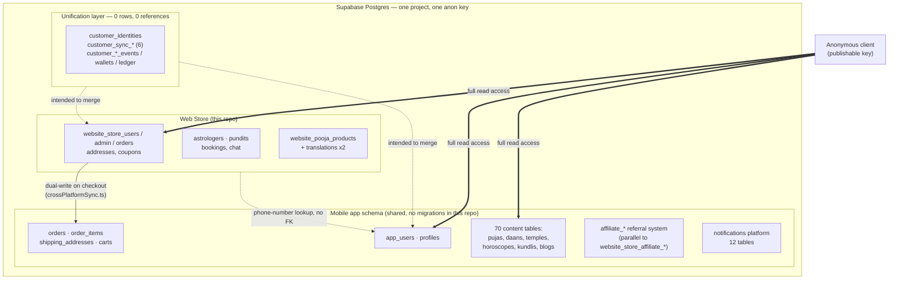

# Supabase Architecture Audit — Store

**Project ref**: `vjkwmefdutltwccpgnny` · **Audited**: 2026-07-23 · **Method**: live introspection (read-only) + static code review

---

## 1. Executive Summary

The Supabase project behind this repository is not a single store database — it is **shared infrastructure for two products**: a mobile spiritual-services app (pujas, daans, horoscopes, astrologer/pundit bookings, wallets) and this web storefront (`website_store_*` tables). Of **163 tables and views** in the project, this repository's code directly queries **32**. The rest belong to the mobile app, to an abandoned unification effort, or exist with no reference anywhere in this codebase.

The most urgent finding is not architectural — it's a live data exposure. Querying the project's public REST API with the same publishable key shipped in the browser bundle returns **full, unfiltered rows from 105 of 163 tables**, including the admin panel's own username/password-hash table, complete customer records (name, email, phone, date of birth, precise location), every order and shipping address, wallet balances, and private astrologer chat messages. This is answerable today, by anyone, with no login.

Underneath that, the codebase shows a recurring pattern: features get rebuilt in parallel rather than reused. There are two admin-account tables, two affiliate/referral systems, three address models, four places a wallet balance can live, and a 17-table "unified customer identity" layer that was scaffolded and never populated. Migration history in the repo also does not reliably reflect the live database — a migration that revokes public read access to the admin table exists in `src/migrations/`, yet that table is openly readable in production right now.

The plan in §9 is ordered by urgency: lock down the open tables and retire the arbitrary-SQL execution pattern first (days), then put a real migration pipeline in place (weeks), then consolidate the duplicated subsystems (months).

**At a glance:**

| | |
|---|---:|
| Tables/views in project | 163 |
| Queried directly by this repo | 32 |
| Fully anon-readable right now | **105** |
| Correctly RLS-locked | 16 |
| Empty (0 rows) | 41 |

---

## 2. Architecture Overview

Everything lives in one Postgres database, reached almost exclusively through PostgREST (Supabase's auto-generated REST API) — there is no backend API layer in front of most tables besides this repo's own `api/` serverless functions, which cover order/payment/OTP flows but not the bulk of reads.



The bridge between the two apps is `src/lib/crossPlatformSync.ts`: when a customer checks out on the website, this repo writes the order to `website_store_orders` **and** to the mobile schema's `orders`/`order_items`/`shipping_addresses`, so the purchase also shows up in the mobile app's order history. The two schemas are joined only by matching a phone number at write time — there is no foreign key between them, so the two order records can silently drift apart if one write fails and the other succeeds.

---

## 3. Critical Findings

### 🔴 CRITICAL — Admin login credentials are readable by anyone, with no login

`website_store_admin` — the table backing this project's own admin panel — returns all 5 rows, **including the `password_hash` column**, to an unauthenticated request using the public/anon key. That key is embedded in the shipped browser bundle; anyone can extract it and read it themselves.

```
GET /rest/v1/website_store_admin?select=* → 5 rows (anon) = 5 rows (service role)
```

This isn't a permissions edge case — it's a full row match: the anonymous key sees exactly what the service-role key sees. Combined with the weak hashing scheme below, this is a direct path to full admin takeover.

### 🔴 CRITICAL — 105 of 163 tables are fully readable by anyone

The same test run across every table in the project shows 105 tables where the anonymous key returns 100% of the rows the service-role key does. Notably:

- `app_users` (46 rows: phone, email, name, DOB)
- `profiles` (46 rows, plus precise lat/long)
- `orders` + `order_items` (112 + 118 rows)
- `shipping_addresses` (20 physical addresses)
- `website_store_users` (140 accounts)
- `coin_transactions` (86 rows, includes recipient phone numbers)
- `user_wallets` (46 balances)
- `astrologer_chat_messages` (private consultation chat content)

By contrast, 16 tables in the same project — `admin_sessions`, `api_configs`, `website_store_orders`, `website_store_addresses` among them — correctly return zero rows to the same anonymous request. This proves the platform is capable of enforcing row-level security properly here; it simply hasn't been applied consistently. Full per-table breakdown in §4.

### 🟠 HIGH — Production frontend code ships logic that re-opens RLS policies via arbitrary SQL execution

`src/components/AdminPanelPage.tsx`, `src/App.tsx`, and `src/components/AstrologerDashboardPage.tsx` all call `supabase.rpc('exec_sql', { sql_query: ... })` directly from client-side code. In `AdminPanelPage.tsx`, the SQL payload being executed re-creates fully permissive policies (`USING (true)`) on `app_users`, `website_store_users`, and `website_store_astrologers` as an "auto-heal" step that runs every time the admin panel loads.

```js
await supabase.rpc('exec_sql', { sql_query: healSql }); // src/components/AdminPanelPage.tsx
```

Live testing during this audit shows the `exec_sql` function does not currently resolve (PostgREST returns "could not find the function" for both the anon and service-role key), so this specific code path is inert today. But `scratch/run_migration.js` confirms this RPC was the actual mechanism used to apply all 89 tracked migrations — **via the anonymous key, not the service-role key** — meaning arbitrary SQL execution was, at some point, callable by anyone with no authentication. The client code depending on it should be deleted regardless of whether the function currently exists: shipping "recreate my RLS policies" SQL text in a public JS bundle is a liability even when the RPC is gone, and an instant full-database compromise the moment it (or anything with that name) reappears.

### 🟠 HIGH — The repo's migration history doesn't reflect the live database

`src/migrations/80_secure_admin_credentials.sql` explicitly enables RLS on `website_store_admin` and drops the policy that made it publicly readable. The finding above shows that table is **still** fully readable in production. Either this migration was never run against the live database, or something after it silently reopened access — and because there's no migration-tracking table and no CLI in this project (confirmed: no `supabase/config.toml`, no `supabase` CLI installed, migrations applied ad hoc via `scratch/run_migration.js`), there's no record of which.

### 🟡 MEDIUM — A default admin password is committed to version control

`src/migrations/01_create_website_store_admin.sql` seeds username `admin` with password `admin123`, hashed with a single unsalted round of SHA-256 — a hash reversible in seconds against any online rainbow table. If this credential was ever used in production and not since rotated, it should be assumed compromised.

### 🟡 MEDIUM — Passwords generally use fast, unsalted hashing

Both `website_store_admin.password_hash` and `website_store_users.password_hash` are populated via single-round SHA-256 (confirmed in migration SQL and in `fn_validate_admin_session`'s companion functions). SHA-256 is designed to be fast, which is the opposite of what you want for password storage — it makes offline brute-forcing cheap, especially relevant given the exposure above. bcrypt, scrypt, or argon2 are the standard replacements.

### ⚪ ARCHITECTURE — A 17-table "unify our two user bases" effort exists, fully scaffolded, entirely unused

`customer_identities`, `customer_identity_map`, four `customer_sync_*` tables, `customer_commerce_profiles`/`events`, `customer_financial_events`, `customer_wallets`/`customer_wallet_transactions`, `customer_addresses`, `customer_refunds`, `financial_transactions`, `ledger_entries`, and a `v_unified_product_orders` view — 17 tables total, every one at zero rows, none referenced anywhere in this repository. The foreign keys (`web_profile_id → profiles.id`, `mobile_user_id → app_users.id`) show real design intent to solve exactly the identity-fragmentation problem described in §6, but it was never finished or switched on.

### ⚪ ARCHITECTURE — Dead code and unused schema surface: `api_configs`

`api_configs` and its four companion RPCs (`get_decrypted_api_key`, `get_api_configs`, `set_api_config`, `delete_api_config`) have zero references anywhere in this repository's app code and no migration history. `razorpay_configuration` appears to be the table that actually replaced it for payment credentials. It's currently RLS-locked (not itself a risk) but is unused surface area worth removing.

---

## 4. Full Table Inventory

Every table and view in the project, grouped by the product domain that owns it, with live row counts pulled directly from the database at audit time.

- **used-here** — this repository's own code (`src/`, `api/`) queries that table directly.
- **ANON-READABLE** — the anonymous/publishable API key returned every row in the table with no filtering — the same key that ships in the browser bundle.
- **RLS-locked** — anonymous requests correctly return zero rows.
- **empty** — zero rows exist right now, either way.


#### Store Commerce Core  (8 tables, 320 rows, **3 anon-readable**)

The tables this repository actually owns end-to-end: web checkout, admin operations, coupons. All migrations for these live in `src/migrations`.

| Table | Rows | Cols | Purpose | Status |
|---|---:|---:|---|---|
| `website_store_users` | 140 | 13 | Web storefront customer accounts — name, email, phone, password hash. Primary identity for web checkout. | used-here, **ANON-READABLE** |
| `website_store_orders` | 97 | 40 | Web storefront order records. Denormalizes line items into a JSON column and duplicates shipping address fields inline rather than referencing website_store_addresses. | used-here, RLS-locked |
| `website_store_addresses` | 51 | 11 | Saved shipping addresses for website_store_users, used in the address book UI. Not foreign-keyed from website_store_orders. | used-here, RLS-locked |
| `website_store_admin` | 5 | 10 | Admin panel operator accounts (username + password hash) for staff who manage orders, products, pundits, astrologers. | used-here, **ANON-READABLE** |
| `website_store_coupons` | 4 | 7 | Discount coupon definitions (code, %, linked product) for the web shop. | used-here, **ANON-READABLE** |
| `website_store_coupon_redemptions` | 0 | 5 | Join table recording which website_store_users redeemed which website_store_coupons. | used-here, empty |
| `order_corrections` | 0 | 20 | Audit trail of post-submission edits admins made to a website_store_orders row (address/item corrections), who made them and why. | used-here, empty |
| `website_settings` | 23 | 3 | Generic key/value store for site-wide configuration flags. | used-here, RLS-locked |

#### Legacy/Mobile Order Pipeline (dual-write target)  (6 tables, 314 rows, **6 anon-readable**)

Belongs to the separate mobile-app schema. This repo's checkout code dual-writes into it (`src/lib/crossPlatformSync.ts`) so a web purchase also shows up in the mobile app's order history.

| Table | Rows | Cols | Purpose | Status |
|---|---:|---:|---|---|
| `orders` | 112 | 12 | Order table belonging to the shared mobile-app schema (buyer = app_users). The web app dual-writes here so a web purchase also appears in the mobile app's unified order history. | used-here, **ANON-READABLE** |
| `order_items` | 118 | 6 | Line items for the mobile-app `orders` table. | used-here, **ANON-READABLE** |
| `shipping_addresses` | 20 | 10 | Shipping address captured per `orders` row in the mobile-app schema — a second, parallel address model to website_store_addresses/customer_addresses. | used-here, **ANON-READABLE** |
| `app_users` | 46 | 9 | Mobile app end-user accounts (phone/email/dob). The identity `orders`, `profiles`, wallets and bookings key off in the shared schema. | used-here, **ANON-READABLE** |
| `carts` | 13 | 3 | Shopping cart header for app_users, one per user. | **ANON-READABLE** |
| `cart_items` | 5 | 7 | Line items inside a `carts` row. | **ANON-READABLE** |

#### Auth, Sessions & Admin Security  (8 tables, 645 rows)

Session and audit tables for both the admin panel and storefront customer login.

| Table | Rows | Cols | Purpose | Status |
|---|---:|---:|---|---|
| `admin_sessions` | 17 | 9 | Active admin login sessions (hashed token, expiry) validated by fn_validate_admin_session(). | used-here, RLS-locked |
| `admin_login_attempts` | 8 | 4 | Rate-limiting/lockout ledger for admin login attempts, keyed by IP. | used-here, RLS-locked |
| `admin_audit_logs` | 282 | 7 | Append-only log of admin actions (282 rows already) for accountability. | used-here, RLS-locked |
| `admin_roles` | 0 | 3 | Maps a user_id to a role name — currently empty; superseded by website_store_admin.role column added in migration 84. | empty |
| `admins` | 1 | 4 | A second, separate admin-account table (username + password hash) with no migration history in this repo and no FK relation to website_store_admin. Not referenced anywhere in the app code found. | RLS-locked |
| `user_sessions` | 141 | 9 | Login sessions for website_store_users (mirrors admin_sessions but for storefront customers). | used-here, RLS-locked |
| `website_store_otp_logs` | 91 | 4 | Log of OTP send/verify attempts for phone-based signup/login (MSG91 integration). | used-here, RLS-locked |
| `website_store_msg91_test_otps` | 105 | 8 | Table for MSG91 OTP provider test/sandbox codes — a testing artifact with 105 live rows. | used-here, RLS-locked |

#### Affiliate System — Web Store (in-repo)  (4 tables, 1 rows, **1 anon-readable**)

A referral program built specifically for the web store, tracked in this repo's migrations. Currently unused (all-empty except settings).

| Table | Rows | Cols | Purpose | Status |
|---|---:|---:|---|---|
| `website_store_affiliates` | 0 | 5 | Web-store-specific affiliate/referrer enrollment records. Currently empty. | empty |
| `website_store_affiliate_commissions` | 0 | 9 | Commission ledger for the web-store affiliate program. Currently empty. | empty |
| `website_store_affiliate_settings` | 1 | 3 | Key/value config for the web-store affiliate program (commission %, cookie window, etc). | **ANON-READABLE** |
| `website_store_affiliate_withdrawals` | 0 | 7 | Withdrawal requests from web-store affiliates. Currently empty. | empty |

#### Affiliate System — Parallel/Mobile (no migration history)  (9 tables, 92 rows, **2 anon-readable**)

A second, functionally near-identical referral program with no migration file in this repo — created directly against the database. This repo's admin panel reads from it (`affiliate_levels`, `affiliate_settings`).

| Table | Rows | Cols | Purpose | Status |
|---|---:|---:|---|---|
| `affiliate_clicks` | 4 | 8 | Click-tracking for the parallel (mobile-schema) referral program, referrer = app/website_store user. | RLS-locked |
| `affiliate_commissions` | 2 | 11 | Commission ledger for the parallel referral program. | RLS-locked |
| `affiliate_levels` | 1 | 5 | Tiered commission-rate definitions (level number → rate) for the parallel referral program; actively read by this repo. | used-here, **ANON-READABLE** |
| `affiliate_relationships` | 1 | 4 | Referrer → referred edges for the parallel referral program. | RLS-locked |
| `affiliate_settings` | 5 | 3 | Key/value config for the parallel referral program; actively read by this repo. | used-here, **ANON-READABLE** |
| `affiliate_wallets` | 19 | 7 | Per-user payable balance for the parallel referral program. | RLS-locked |
| `affiliate_withdrawals` | 0 | 10 | Withdrawal requests for the parallel referral program. Currently empty. | empty |
| `affiliate_audit_logs` | 60 | 7 | Action log for the parallel referral/affiliate program (60 rows). | RLS-locked |
| `user_referrals` | 0 | 5 | Referrer/referee edges tied to app_users — a third referral-edge table alongside affiliate_relationships and website_store_users.referred_by. | empty |

#### Astrologer & Pundit Services  (10 tables, 56 rows, **9 anon-readable**)

Bookable-service directories (astrologers, pundits) and their bookings/chat — a real, actively-used part of this web app.

| Table | Rows | Cols | Purpose | Status |
|---|---:|---:|---|---|
| `website_store_astrologers` | 10 | 16 | Astrologer directory profiles bookable from the web store (rating, specialties, per-minute rate). | used-here, **ANON-READABLE** |
| `website_store_astrologer_translations` | 10 | 13 | Per-locale text overrides (bio, title, specialties) for a website_store_astrologers row. | **ANON-READABLE** |
| `localized_website_store_astrologers` | 10 | 16 | A fully duplicated, per-locale COPY of the entire website_store_astrologers row — a second, heavier localization mechanism next to *_translations. | **ANON-READABLE** |
| `website_store_pundits` | 6 | 26 | Pundit (ritual officiant) directory profiles, including verification documents (Aadhaar/certificate URLs). | used-here, **ANON-READABLE** |
| `website_store_pundit_translations` | 6 | 16 | Per-locale text overrides for a website_store_pundits row. | **ANON-READABLE** |
| `localized_website_store_pundits` | 6 | 26 | Fully duplicated per-locale copy of website_store_pundits — same redundant pattern as astrologers. | **ANON-READABLE** |
| `website_store_pundit_bookings` | 2 | 16 | Booking requests for a pundit-performed puja (date, venue, dakshina amount). | used-here, **ANON-READABLE** |
| `astrologer_bookings` | 2 | 11 | Booking/session records between an app_users customer and a website_store_astrologers row. | used-here, **ANON-READABLE** |
| `astrologer_chat_messages` | 4 | 6 | Chat message content exchanged during an astrologer_bookings session. | used-here, **ANON-READABLE** |
| `pandit_videos` | 0 | 10 | Video content associated with pundits. Currently empty. | empty |

#### Web Shop Product Catalog  (10 tables, 170 rows, **7 anon-readable**)

Two unrelated product catalogs: `website_pooja_products` (what the storefront actually sells) and `store_products`/`stores` (a multi-seller marketplace model that appears unused by any storefront page).

| Table | Rows | Cols | Purpose | Status |
|---|---:|---:|---|---|
| `website_pooja_products` | 32 | 68 | Master catalog of shoppable puja/ritual products sold on the web store (68 columns — pricing, specs, media, SEO fields all on one row). | used-here, **ANON-READABLE** |
| `website_pooja_product_translations` | 32 | 40 | Per-locale text fields (name, description) for a website_pooja_products row. | **ANON-READABLE** |
| `localized_website_pooja_products` | 64 | 61 | Fully duplicated per-locale copy of website_pooja_products (61 columns) — the same product data a third time. | used-here, **ANON-READABLE** |
| `product_translations` | 31 | 12 | Yet another translations side-table, keyed to website_pooja_products, overlapping with website_pooja_product_translations. | **ANON-READABLE** |
| `categories` | 0 | 10 | Product category tree (parent_id self-reference). Currently empty — the live category_by_product join table has no categories to join to. | empty |
| `category_translations` | 0 | 8 | Per-locale names for `categories`. Currently empty. | empty |
| `localized_categories` | 0 | 7 | Duplicated per-locale copy of `categories`. Currently empty. | empty |
| `category_by_product` | 5 | 5 | Product-to-category join table with 5 rows despite `categories` being empty. | **ANON-READABLE** |
| `store_products` | 4 | 28 | A second, separate product catalog scoped to `stores`, unrelated to website_pooja_products. | **ANON-READABLE** |
| `stores` | 2 | 14 | Multi-store/seller definitions for the store_products catalog — a marketplace concept not otherwise wired into the web storefront. | **ANON-READABLE** |

#### Mobile App Identity/Profile  (6 tables, 213 rows, **6 anon-readable**)

The mobile app's own user/wallet/gamification tables. `profiles` is queried by this repo (`src/lib/crossPlatformSync.ts`) to look up a name by phone number during web checkout.

| Table | Rows | Cols | Purpose | Status |
|---|---:|---:|---|---|
| `profiles` | 46 | 19 | Mobile-app user profile (astrology-specific fields: gotra, rashi, nakshatra, geo-location) — a second identity/profile record for the same person as app_users. | used-here, **ANON-READABLE** |
| `user_wallets` | 46 | 4 | Simple coin/credit balance for an app_users account. | **ANON-READABLE** |
| `coin_transactions` | 86 | 6 | Ledger of coin credits/debits against user_wallets, including phone-based coin gifting. | **ANON-READABLE** |
| `user_unlocked_flowers` | 4 | 4 | Gamification unlock state: which god_flowers a user has unlocked. | **ANON-READABLE** |
| `user_unlocked_thalis` | 4 | 4 | Gamification unlock state: which god_thalis a user has unlocked. | **ANON-READABLE** |
| `user_push_tokens` | 27 | 6 | Device push-notification tokens per app_users account. | **ANON-READABLE** |

#### Customer Unification Layer (empty/unused)  (17 tables, 0 rows)

A 17-table 'unify mobile + web identities' effort — `customer_identities`, sync/conflict tracking, a unified wallet and ledger. Zero rows in every table, zero references anywhere in this repo.

| Table | Rows | Cols | Purpose | Status |
|---|---:|---:|---|---|
| `customer_identities` | 0 | 4 | Root record of an in-progress 'unified customer' model meant to merge app_users/profiles and website_store_users into one canonical identity. Zero rows — never activated. | empty |
| `customer_identity_map` | 0 | 8 | Would link a customer_identities row to its web profile and mobile user rows. Empty. | empty |
| `customer_sync_events` | 0 | 5 | Would log identity-merge sync events. Empty. | empty |
| `customer_sync_locks` | 0 | 4 | Would prevent concurrent sync jobs per customer. Empty. | empty |
| `customer_sync_logs` | 0 | 6 | Would record sync job outcomes. Empty. | empty |
| `customer_sync_conflicts` | 0 | 12 | Would hold conflicting-field cases needing manual resolution during identity merge. Empty. | empty |
| `customer_commerce_profiles` | 0 | 8 | Would hold a unified commerce profile (preferred address, etc.) per customer_identities row. Empty. | empty |
| `customer_commerce_events` | 0 | 5 | Would log unified commerce events (cart, purchase). Empty. | empty |
| `customer_financial_events` | 0 | 5 | Would log unified financial events. Empty. | empty |
| `customer_auth_attributes` | 0 | 7 | Would hold unified auth attributes per customer. Empty. | empty |
| `customer_addresses` | 0 | 16 | Would be the unified address book, a third address model alongside website_store_addresses and shipping_addresses. Empty. | empty |
| `customer_refunds` | 0 | 9 | Would track refunds against financial_transactions. Empty. | empty |
| `customer_wallets` | 0 | 5 | Would be a unified wallet, a fourth balance model alongside user_wallets/affiliate_wallets/coin_transactions. Empty. | empty |
| `customer_wallet_transactions` | 0 | 9 | Would log unified wallet transactions. Empty. | empty |
| `financial_transactions` | 0 | 11 | Would be the unified financial ledger underpinning customer_refunds/ledger_entries. Empty. | empty |
| `ledger_entries` | 0 | 6 | Would be double-entry ledger lines against financial_transactions. Empty. | empty |
| `v_unified_product_orders` | 0 | 13 | A view meant to present orders across mobile + web schemas as one unified feed. Empty/unused today. | empty |

#### Notifications System  (12 tables, 298 rows, **11 anon-readable**)

A full push-notification platform (templates, segments, scheduler, delivery tracking) shared with the mobile app; this repo only writes to `push_notifications` directly.

| Table | Rows | Cols | Purpose | Status |
|---|---:|---:|---|---|
| `push_notifications` | 32 | 34 | Individual push notification records (34 columns) actively used by this repo's notification feature. | used-here, **ANON-READABLE** |
| `notification_templates` | 5 | 16 | Reusable notification copy/template definitions. | **ANON-READABLE** |
| `notification_segments` | 5 | 7 | Audience-segment definitions for targeted notification campaigns. | **ANON-READABLE** |
| `notification_sounds` | 5 | 5 | Selectable notification sound assets. | **ANON-READABLE** |
| `notification_scheduler_logs` | 19 | 7 | Execution log for the notification scheduler worker. | **ANON-READABLE** |
| `notification_scheduler_health` | 1 | 8 | Heartbeat/health status row(s) for the scheduler. | **ANON-READABLE** |
| `notification_worker_heartbeats` | 4 | 6 | Heartbeat per named background worker process. | **ANON-READABLE** |
| `notification_versions` | 0 | 11 | Version history for edited notification content. Empty. | empty |
| `notification_delivery_status` | 183 | 16 | Per-recipient delivery status for a push_notifications row (183 rows). | **ANON-READABLE** |
| `notification_dashboard_view` | 1 | 9 | A rollup view for a notifications admin dashboard. | **ANON-READABLE** |
| `notification_delivery_summary_view` | 11 | 7 | Aggregated delivery counts per notification. | **ANON-READABLE** |
| `notification_history_view` | 32 | 17 | Combined historical view of sent notifications. | **ANON-READABLE** |

#### Payments  (3 tables, 9 rows)

Payment-provider credentials and webhook logs.

| Table | Rows | Cols | Purpose | Status |
|---|---:|---:|---|---|
| `razorpay_configuration` | 2 | 15 | Encrypted Razorpay API credentials (key/secret with IV + auth tag) and live/test mode flag — correctly access-locked. | used-here, RLS-locked |
| `razorpay_webhook_events` | 0 | 9 | Raw Razorpay webhook payload log for payment verification/idempotency. Currently empty. | used-here, empty |
| `api_configs` | 7 | 9 | A generic encrypted third-party API credential store with matching get/set/delete RPCs — no longer referenced anywhere in this codebase; superseded by razorpay_configuration. | RLS-locked |

#### Spiritual Content Library (mobile app — poojas/temples/etc.)  (70 tables, 724 rows, **60 anon-readable**)

70 tables of devotional content (pujas, daans, temples, horoscopes, festivals, blogs) that back the mobile app's content feed. Almost none of it is queried by this web repository, apart from `video_reviews` and the `website_pooja_product` family.

| Table | Rows | Cols | Purpose | Status |
|---|---:|---:|---|---|
| `general_poojas` | 14 | 38 | Master catalog of bookable general puja rituals shown in the mobile app (38 columns of pricing/specs/media). | **ANON-READABLE** |
| `pooja_translations` | 28 | 16 | Per-locale translation fields for general_poojas. | **ANON-READABLE** |
| `one_rupee_poojas` | 15 | 38 | Catalog of promotional '₹1 puja' offers. | **ANON-READABLE** |
| `one_rupee_pooja_translations` | 30 | 20 | Per-locale text override fields for a one rupee pooja row — first of two parallel i18n mechanisms used across this content library. | **ANON-READABLE** |
| `localized_one_rupee_poojas` | 15 | 36 | Fully duplicated per-locale copy of the entire one rupee poojas row — second, heavier i18n mechanism sitting alongside *_translations for the same content. | **ANON-READABLE** |
| `problem_poojas` | 18 | 36 | Source-of-truth content row for problem poojas shown in the mobile app (default language). | **ANON-READABLE** |
| `problem_pooja_translations` | 36 | 16 | Per-locale text override fields for a problem pooja row — first of two parallel i18n mechanisms used across this content library. | **ANON-READABLE** |
| `localized_problem_poojas` | 18 | 32 | Fully duplicated per-locale copy of the entire problem poojas row — second, heavier i18n mechanism sitting alongside *_translations for the same content. | **ANON-READABLE** |
| `combo_poojas` | 0 | 28 | Bundled multi-puja package definitions. Currently empty. | empty |
| `offer_pujas` | 8 | 18 | Puja items attached to a promotional offer_sections campaign. | **ANON-READABLE** |
| `offer_pooja_translations` | 8 | 9 | Per-locale text override fields for a offer pooja row — first of two parallel i18n mechanisms used across this content library. | **ANON-READABLE** |
| `localized_offer_pujas` | 8 | 18 | Fully duplicated per-locale copy of the entire offer pujas row — second, heavier i18n mechanism sitting alongside *_translations for the same content. | **ANON-READABLE** |
| `offer_sections` | 2 | 12 | Homepage promotional campaign/section definitions. | **ANON-READABLE** |
| `offer_section_translations` | 3 | 10 | Per-locale text override fields for a offer section row — first of two parallel i18n mechanisms used across this content library. | **ANON-READABLE** |
| `localized_offer_sections` | 2 | 11 | Fully duplicated per-locale copy of the entire offer sections row — second, heavier i18n mechanism sitting alongside *_translations for the same content. | **ANON-READABLE** |
| `daily_pujas` | 15 | 16 | Puja scheduled for a specific day_of_week, linking to general/one-rupee poojas. | **ANON-READABLE** |
| `daily_pooja_translations` | 15 | 9 | Per-locale text override fields for a daily pooja row — first of two parallel i18n mechanisms used across this content library. | **ANON-READABLE** |
| `localized_daily_pujas` | 15 | 16 | Fully duplicated per-locale copy of the entire daily pujas row — second, heavier i18n mechanism sitting alongside *_translations for the same content. | **ANON-READABLE** |
| `daily_puja_details` | 15 | 15 | Extended detail content for a daily_pujas entry. | **ANON-READABLE** |
| `daily_puja_detail_translations` | 15 | 12 | Per-locale text override fields for a daily puja detail row — first of two parallel i18n mechanisms used across this content library. | **ANON-READABLE** |
| `localized_daily_puja_details` | 15 | 16 | Fully duplicated per-locale copy of the entire daily puja details row — second, heavier i18n mechanism sitting alongside *_translations for the same content. | **ANON-READABLE** |
| `daily_sections` | 7 | 6 | The 7 day-of-week rows daily_pujas hang off (id = day name). | **ANON-READABLE** |
| `daily_section_translations` | 14 | 8 | Per-locale text override fields for a daily section row — first of two parallel i18n mechanisms used across this content library. | **ANON-READABLE** |
| `localized_daily_sections` | 7 | 6 | Fully duplicated per-locale copy of the entire daily sections row — second, heavier i18n mechanism sitting alongside *_translations for the same content. | **ANON-READABLE** |
| `puja_details` | 8 | 16 | Extended detail/story content for an offer_pujas entry. | **ANON-READABLE** |
| `puja_detail_translations` | 8 | 12 | Per-locale text override fields for a puja detail row — first of two parallel i18n mechanisms used across this content library. | **ANON-READABLE** |
| `localized_puja_details` | 8 | 15 | Fully duplicated per-locale copy of the entire puja details row — second, heavier i18n mechanism sitting alongside *_translations for the same content. | **ANON-READABLE** |
| `puja_booking_details` | 11 | 8 | Booking-specific details captured against a mobile-schema `orders` row for a puja purchase. | **ANON-READABLE** |
| `puja_banners` | 4 | 11 | Promotional banner creatives for puja campaigns. | **ANON-READABLE** |
| `daans` | 19 | 12 | Catalog of charitable-donation ('daan') offerings. | **ANON-READABLE** |
| `daan_translations` | 38 | 10 | Per-locale text override fields for a daan row — first of two parallel i18n mechanisms used across this content library. | **ANON-READABLE** |
| `localized_daans` | 19 | 12 | Fully duplicated per-locale copy of the entire daans row — second, heavier i18n mechanism sitting alongside *_translations for the same content. | **ANON-READABLE** |
| `daan_bookings` | 1 | 11 | A user's booking/purchase of a daans entry, tied to app_users and to a mobile `orders` row. | **ANON-READABLE** |
| `temples` | 0 | 11 | Temple directory entries. Currently empty. | empty |
| `temple_translations` | 0 | 9 | Per-locale text override fields for a temple row — first of two parallel i18n mechanisms used across this content library. | empty |
| `localized_temples` | 0 | 10 | Fully duplicated per-locale copy of the entire temples row — second, heavier i18n mechanism sitting alongside *_translations for the same content. | empty |
| `god_categories` | 5 | 6 | Deity category taxonomy (e.g. Shiva, Vishnu) used to group god_flowers/god_thalis/god_images. | **ANON-READABLE** |
| `god_category_translations` | 6 | 7 | Per-locale text override fields for a god category row — first of two parallel i18n mechanisms used across this content library. | **ANON-READABLE** |
| `localized_god_categories` | 5 | 6 | Fully duplicated per-locale copy of the entire god categories row — second, heavier i18n mechanism sitting alongside *_translations for the same content. | **ANON-READABLE** |
| `god_flowers` | 4 | 9 | Catalog of unlockable/offerable 'flower' items tied to a god_categories entry. | **ANON-READABLE** |
| `god_flower_translations` | 5 | 7 | Per-locale text override fields for a god flower row — first of two parallel i18n mechanisms used across this content library. | **ANON-READABLE** |
| `localized_god_flowers` | 4 | 9 | Fully duplicated per-locale copy of the entire god flowers row — second, heavier i18n mechanism sitting alongside *_translations for the same content. | **ANON-READABLE** |
| `god_thalis` | 6 | 8 | Catalog of unlockable/offerable 'thali' (ritual plate) items. | **ANON-READABLE** |
| `god_thali_translations` | 7 | 7 | Per-locale text override fields for a god thali row — first of two parallel i18n mechanisms used across this content library. | **ANON-READABLE** |
| `localized_god_thalis` | 6 | 8 | Fully duplicated per-locale copy of the entire god thalis row — second, heavier i18n mechanism sitting alongside *_translations for the same content. | **ANON-READABLE** |
| `god_images` | 17 | 6 | Deity image assets grouped by god_categories.name. | **ANON-READABLE** |
| `life_problems` | 5 | 8 | Catalog of 'life problem' categories (e.g. career, marriage) used to recommend problem_poojas. | **ANON-READABLE** |
| `life_problem_translations` | 10 | 7 | Per-locale text override fields for a life problem row — first of two parallel i18n mechanisms used across this content library. | **ANON-READABLE** |
| `localized_life_problems` | 5 | 8 | Fully duplicated per-locale copy of the entire life problems row — second, heavier i18n mechanism sitting alongside *_translations for the same content. | **ANON-READABLE** |
| `spiritual_calendar` | 20 | 19 | Day-by-day auspicious-date/festival calendar data, keyed by date. | **ANON-READABLE** |
| `localized_spiritual_calendar` | 20 | 19 | Fully duplicated per-locale copy of the entire spiritual calendar row — second, heavier i18n mechanism sitting alongside *_translations for the same content. | **ANON-READABLE** |
| `festival_translations` | 21 | 11 | Per-locale festival name/description tied to a spiritual_calendar date. | **ANON-READABLE** |
| `horoscopes` | 37 | 14 | Daily/periodic horoscope content per zodiac sign. | **ANON-READABLE** |
| `kundlis` | 4 | 14 | Generated birth-chart (kundli) records. | **ANON-READABLE** |
| `panchangs` | 20 | 9 | Daily Hindu almanac (panchang) data. | **ANON-READABLE** |
| `choghadiyas` | 26 | 8 | Auspicious time-window (choghadiya) data per day. | **ANON-READABLE** |
| `homepage_hero` | 5 | 10 | Mobile app home-screen hero banner content. | **ANON-READABLE** |
| `localized_homepage_hero` | 5 | 10 | Fully duplicated per-locale copy of the entire homepage hero row — second, heavier i18n mechanism sitting alongside *_translations for the same content. | **ANON-READABLE** |
| `home_feed_translations` | 6 | 9 | Per-locale text for a homepage_hero entry. | **ANON-READABLE** |
| `banners` | 2 | 7 | Generic promotional banner assets. | **ANON-READABLE** |
| `blogs` | 0 | 6 | Blog post content. Currently empty. | empty |
| `blog_translations` | 0 | 10 | Per-locale text override fields for a blog row — first of two parallel i18n mechanisms used across this content library. | empty |
| `localized_blogs` | 0 | 10 | Fully duplicated per-locale copy of the entire blogs row — second, heavier i18n mechanism sitting alongside *_translations for the same content. | empty |
| `faqs` | 0 | 5 | FAQ entries. Currently empty. | empty |
| `faq_translations` | 0 | 8 | Per-locale text override fields for a faq row — first of two parallel i18n mechanisms used across this content library. | empty |
| `localized_faqs` | 0 | 7 | Fully duplicated per-locale copy of the entire faqs row — second, heavier i18n mechanism sitting alongside *_translations for the same content. | empty |
| `video_reviews` | 5 | 11 | Customer testimonial video entries; actively used by this repo. | used-here, **ANON-READABLE** |
| `video_review_translations` | 10 | 9 | Per-locale text override fields for a video review row — first of two parallel i18n mechanisms used across this content library. | **ANON-READABLE** |
| `localized_video_reviews` | 5 | 11 | Fully duplicated per-locale copy of the entire video reviews row — second, heavier i18n mechanism sitting alongside *_translations for the same content. | **ANON-READABLE** |
| `localized_general_poojas` | 14 | 32 | Fully duplicated per-locale copy of general_poojas. | **ANON-READABLE** |

---

## 5. How the Tables Relate

**Within the web store**, relationships are conventional and mostly sound: `website_store_orders.user_id → website_store_users.id`, `website_store_addresses.user_id → website_store_users.id`, `website_store_pundit_bookings.pundit_id → website_store_users.id`, `order_corrections.order_id → website_store_orders.id`. The one gap: `website_store_orders` stores delivery address and line items as inline text/JSONB columns rather than foreign keys into `website_store_addresses` — reasonable if that's a deliberate point-in-time snapshot of the address at purchase, but nothing in the migrations documents that as intentional versus an oversight.

**Within the mobile content library**, relationships follow one consistent, sensible shape per content type: a base table (e.g. `daily_pujas`) → a `*_details` table for long-form content → a `*_translations` table per locale. What breaks the pattern is that roughly half of these content types **also** have a `localized_*` table that duplicates the entire parent row per locale — a second, redundant relationship doing the same job (see §6).

**Across the two apps**, there are no foreign keys at all. `app_users`/`profiles` (mobile identity) and `website_store_users` (web identity) are related only by an application-level phone-number match in `crossPlatformSync.ts`. The `customer_identities`/`customer_identity_map` tables look like an attempt to formalize exactly this relationship with real foreign keys (`web_profile_id → profiles.id`, `mobile_user_id → app_users.id`) — but the layer was never populated or wired up.

---

## 6. Duplicate & Redundant Structures

| Concept | Parallel tables | Note |
|---|---|---|
| Admin accounts | `admins` | Separate from `website_store_admin`, no FK, no migration, not referenced by any code found in this repo. 1 row. |
| Referral / affiliate program | `affiliate_*` (9 tables) | Runs alongside `website_store_affiliate_*` (4 tables). This repo reads `affiliate_levels`/`affiliate_settings` from the first family while `website_store_affiliate_*` sits empty — suggesting the web-store-specific version was started and abandoned in favor of the older shared one. |
| Address book | `shipping_addresses`, `website_store_addresses`, `customer_addresses` | Three separate address models for what is conceptually one "where do we ship this" concern. |
| Wallet / balance | `user_wallets`, `affiliate_wallets`, `customer_wallets`, `coin_transactions` | Four places a monetary or credit balance can live for the same person, with no shared ledger. |
| User identity | `app_users`, `profiles`, `website_store_users`, `customer_identities` | Four candidate "who is this person" records; `customer_identities` was meant to resolve this and never launched. |
| Product catalog | `website_pooja_products`, `store_products`/`stores` | Two unrelated catalog models; `store_products`/`stores` (multi-seller shape) has 4 and 2 rows respectively and isn't queried anywhere in this repo. |
| Localization | `*_translations` vs `localized_*` | Two competing i18n strategies applied inconsistently across ~35 content types — see below. |

**The localization split, specifically:** for most mobile-content types (pujas, daans, temples, gods, life problems, homepage sections, video reviews), the project maintains *both*: a `*_translations` side-table holding just the translated fields, *and* a `localized_*` table holding a full duplicate of every column, per locale. A single content edit therefore has to be applied in up to three places (base table, translations table, localized table) with nothing in the schema enforcing that they stay in sync. `website_pooja_products` alone carries the pattern across three tables at 68, 40, and 61 columns.

---

## 7. Performance & Scalability

**Wide, single-row tables.** `website_pooja_products` (68 columns), `general_poojas`/`one_rupee_poojas` (38), and `problem_poojas` (36) mix pricing, specs, media URLs, and SEO metadata in one row. Every read pulls all of it even when a listing view only needs six fields. Worth splitting frequently-read summary columns from rarely-read detail/SEO columns, or at minimum using explicit `select=` projections everywhere (the codebase does use `select('*')` in several places found during this audit).

**JSON line items block reporting.** `website_store_orders.items` is a JSONB blob, so answering "what are our best-selling products" or "revenue by SKU" means scanning and parsing JSON across every order row instead of a simple `GROUP BY` on a line-items table. The schema already has a working normalized pattern for this — `order_items` — it's just attached to the other (mobile) order pipeline, not to `website_store_orders`.

**No visibility into indexes from this audit.** The introspection here was done through Supabase's REST API (PostgREST), which exposes columns and foreign keys but not index definitions. Given how many lookups filter by foreign-key columns (`user_id`, `order_id`, `product_id` across dozens of tables), a direct SQL review of `pg_indexes` is worth doing before scaling traffic — this audit could not confirm those columns are indexed.

**Anonymous access is also a cost/abuse surface, not just a privacy one.** With 105 tables openly readable, there's nothing stopping automated scraping of the full product catalog, content library, or (worse) the customer/order tables at whatever rate the caller chooses — Supabase's own rate limiting is the only backstop today.

---

## 8. Data Organization

**Naming doesn't reliably signal ownership.** Every table this repo's migrations create is prefixed `website_store_` — except `orders`, and the repo writes to that unprefixed, mobile-owned table directly. A developer scanning table names for what belongs to the web store will miss this.

**No migration ever created ~70% of the schema.** Cross-referencing all 163 tables against `src/migrations/*.sql` (89 files) shows only the web-store-owned tables and a handful of others were created through tracked migrations. The mobile content library, the parallel affiliate system, the customer-unification layer, and `admins` have no corresponding migration in this repo — they were created directly against the database (SQL editor, another repo, or both). That's expected for genuinely-external tables, but it also means this repo cannot reconstruct or review the schema of ~70% of the database it depends on.

**Repo migrations and live schema have already diverged once, confirmed.** `src/migrations/80_secure_admin_credentials.sql` enables RLS on `website_store_admin` and drops its public-read policy. Live testing during this audit shows the table is still fully readable by the anonymous key. Either that migration was never applied to production, or a later, untracked change re-opened it.

---

## 9. Improvement Plan

### Phase 0 — Stop the bleeding (days)

1. **Write and apply real RLS SELECT policies on all 105 anon-open tables**, starting with `website_store_admin`, `app_users`, `profiles`, `orders`/`order_items`/`shipping_addresses`, `coin_transactions`, `user_wallets`, `website_store_users`, and `astrologer_chat_messages`.
   - *Why:* these tables are readable end-to-end by any unauthenticated caller right now; this is the single highest-impact fix available.
   - *Benefit:* closes the active PII/credential/financial-data exposure immediately, with no application code changes required — RLS is enforced at the database layer.
2. **Delete every client-side call to `supabase.rpc('exec_sql', ...)`** from `App.tsx`, `AdminPanelPage.tsx`, and `AstrologerDashboardPage.tsx`; confirm the `exec_sql` function does not exist in any environment (dev/staging/prod) and drop it if it does.
   - *Why:* arbitrary SQL execution reachable from a public API key is equivalent to full database compromise; the fact it's currently 404 is luck, not a fix.
   - *Benefit:* permanently removes a full-database-compromise vector and stops shipping RLS-policy SQL text inside the public JS bundle.
3. **Rotate the seeded default admin credential**, force a password reset for all admin accounts, and move `password_hash` storage to bcrypt/argon2.
   - *Why:* the default admin/admin123 credential is in git history and was hashed with a single round of unsalted SHA-256.
   - *Benefit:* removes a known, guessable credential and makes any future hash leak far more expensive to crack.
4. **Reconcile actual production RLS state** against `src/migrations/80` and `81` via a direct SQL session (Supabase Studio or psql) before trusting either.
   - *Why:* this audit found at least one migration whose effect (revoking admin table access) does not match live behavior — the repo cannot currently be trusted as ground truth for schema state.
   - *Benefit:* establishes a known-good baseline to build the migration pipeline in Phase 1 on top of.

### Phase 1 — Make schema changes trustworthy (2–4 weeks)

1. **Adopt the Supabase CLI** (or equivalent) with a real migration-tracking table, and retire `scratch/run_migration.js` + the `exec_sql` pattern entirely.
   - *Why:* today, "run a migration" means posting raw SQL to an RPC using the anon key with no record of what ran or when — that's how the repo and the live database diverged in the first place.
   - *Benefit:* every future schema change is applied exactly once, in order, through a service-role-authenticated path, and is reviewable in git.
2. **Add an automated RLS regression check to CI** — essentially this audit's access-scan (query every table anonymously, compare row counts to service-role counts) run on a schedule.
   - *Why:* the admin-table exposure in §3 could have been caught the day it happened instead of during a manual audit.
   - *Benefit:* a silent policy regression becomes a failing check instead of a live incident.
3. **Route sensitive reads/writes exclusively through the existing `api/` serverless functions** (which already use the service-role key correctly for payments and OTP) instead of direct client-to-Supabase calls for privileged operations.
   - *Why:* the frontend currently talks to Supabase directly with the anon key for admin operations, which is what made the `exec_sql` pattern possible in the first place.
   - *Benefit:* a single, auditable server-side boundary for anything privileged, instead of relying entirely on RLS as the only line of defense.

### Phase 2 — Remove duplication (1–2 months)

1. **Pick one affiliate/referral system** — this repo already reads `affiliate_levels`/`affiliate_settings`, not the `website_store_affiliate_*` family — migrate any real data, then drop the losing family (up to 9 tables).
   - *Why:* two parallel referral systems means every future feature (commission rules, payout logic) has to be built or bug-fixed twice.
   - *Benefit:* one commission engine, one source of truth for referral state, less surface area to secure and maintain.
2. **Decide the fate of the `customer_identities`/`customer_sync` unification layer**: finish and adopt it, or drop all 17 tables.
   - *Why:* zero-row, zero-reference tables sitting in a production schema indefinitely cost review time and create false signals during audits like this one, with no offsetting benefit while dormant.
   - *Benefit:* either a real fix for the `app_users`/`website_store_users` identity split, or a smaller, easier-to-reason-about schema.
3. **Normalize `website_store_orders.items`** (currently JSONB) into line-item rows, reusing or extending the existing `order_items` table/shape.
   - *Why:* "best-selling products" and "revenue by SKU" currently require parsing JSON across every order row instead of a `GROUP BY`.
   - *Benefit:* real reporting/analytics on web-store sales becomes a simple query instead of an application-side JSON scan.
4. **Pick one localization strategy** for the content library — the `*_translations` side-table pattern is cheaper to keep in sync than a full-row `localized_*` duplicate — and migrate off the other, starting with the highest-traffic content types (`website_pooja_products`, `general_poojas`).
   - *Why:* maintaining both means every content edit has to be applied in up to three places with nothing enforcing consistency between them.
   - *Benefit:* content edits become single-source, eliminating an entire class of "translation shows stale data" bugs.

### Phase 3 — Structural decisions (ongoing / next planning cycle)

1. **Decide deliberately whether the web store and mobile app should keep sharing one Supabase project.**
   - *Why:* right now, a security incident in either app's tables can cascade into the other purely because they sit in the same Postgres instance with overlapping key scope — there's no isolation between "the store got compromised" and "the mobile app's user base got compromised."
   - *Benefit:* either a documented, intentional shared-platform architecture with real isolation (separate schemas, separate roles/grants, no shared anon key scope), or a clean split — either is better than the current undocumented default.
2. **Remove confirmed-unused tables**: `api_configs` (+ its 4 RPCs), `admins` (superseded by `website_store_admin`), and any content tables (`temples`, `blogs`, `faqs`, `categories`) that stay empty with no roadmap item to populate them.
   - *Why:* each one is schema surface area that has to be considered in every future security review, including this one.
   - *Benefit:* a smaller, more legible schema — directly addresses the "unnecessary tables" part of this audit's brief.
3. **Add a naming convention that actually signals ownership** (e.g. require every web-store table to use the `website_store_` prefix, including moving off the shared `orders` table or explicitly documenting it as a deliberate cross-app bridge).
   - *Why:* this repo currently writes directly to a mobile-owned, unprefixed `orders` table, which is easy to mistake for dead legacy code rather than live dual-write logic.
   - *Benefit:* a new engineer can tell what owns a table by its name alone, without archaeology.

---

## 10. Methodology

This audit introspected the live database directly rather than relying solely on repo history, since the two are known to diverge (§8). Steps taken, in order:

1. Fetched the project's PostgREST OpenAPI document (`GET /rest/v1/`) with the service-role key to enumerate all 163 tables/views, every column, type, primary key, and foreign key.
2. For every table, issued a `limit=1` read with `Prefer: count=exact` using both the service-role key and the public/anon key, to get an authoritative row count and compare it against what an anonymous caller can actually see — the basis for every "anon-readable" / "RLS-locked" label in §4.
3. Grepped this repository's `src/`, `api/`, `server.js` for `.from('table')`/`.rpc('name')` calls to determine actual usage, excluding two vendored/bundled library files (`api/seo-render.js`, `api/sitemap.js`) whose embedded JSDoc examples reference fictional tables like `countries`/`avatars` that don't exist in this project.
4. Cross-referenced all 89 files in `src/migrations/` (plus `db/migrations/`) against the live schema to establish which tables this repo's history actually accounts for, and to check specific claims (e.g. migration 80 vs. live RLS state).
5. Verified the `exec_sql` RPC finding by issuing a harmless, read-only `SELECT 1` through it with the anon key (confirmed the function does not currently resolve) and by reading the calling code in `App.tsx`, `AdminPanelPage.tsx`, `AstrologerDashboardPage.tsx`, and `scratch/run_migration.js`.

**No write, update, or delete operations were issued against the database at any point in this audit.**

Re-run the access scan periodically — RLS state can change without a corresponding code change.
