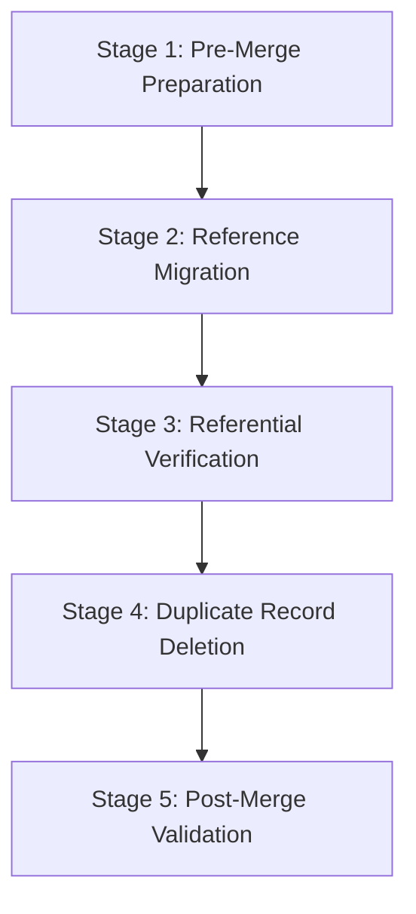
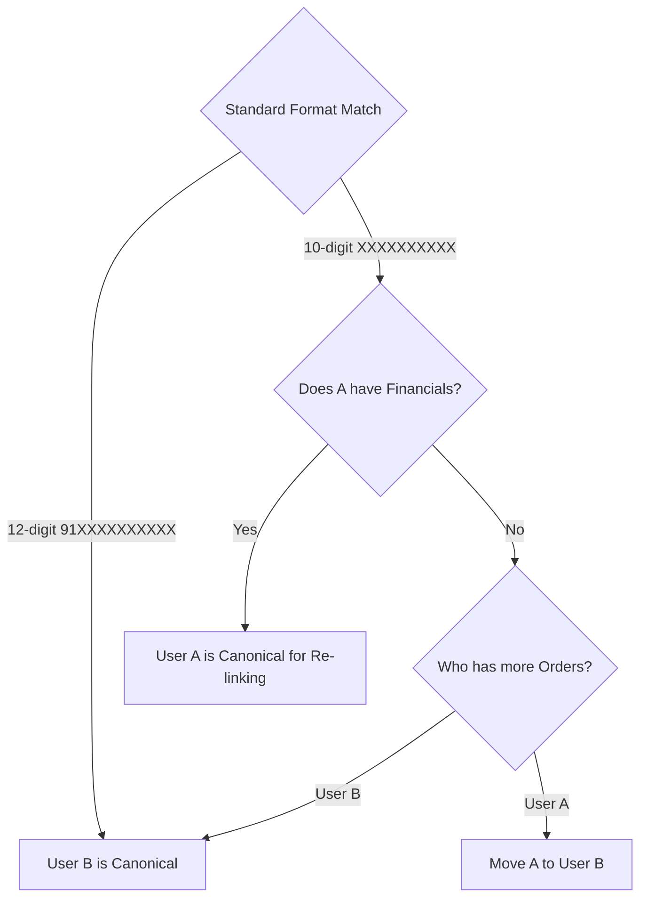

# website-store-users Duplicate Merge Implementation Blueprint

**Document Reference**: SUPABASE-MERGE-BLUEPRINT-2026  
**Status**: Planning Only · Production-Ready Blueprint  
**Date**: 2026-07-24 · **Author**: Antigravity (Advanced Agentic Coding Team, Google DeepMind)  

---

## 1. Executive Summary

This blueprint defines the safe, transaction-backed, batch-executable production strategy for merging duplicate website user accounts in the Supabase database. 

Our prior audit successfully mapped **42 duplicate phone groups** representing **84 user profiles** in the `website_store_users` table. The duplication was caused by a normalization split between the client-side code (which cleans and inserts 10-digit formats like `8819897434`) and the serverless backend API (which normalizes to the 12-digit format `918819897434`). 

The goal of this planning blueprint is to establish a step-by-step roadmap to re-link all active dependent records—including **59 orders**, **33 shipping addresses**, **69 login sessions**, and **15 affiliate/financial rows**—to their canonical 12-digit identities, and safely remove the duplicate records without losing data or causing service downtime.

---

## 2. Merge Architecture

To guarantee data safety, the merge procedure is split into five distinct logical stages. Each stage represents a critical gateway that must pass validation before proceeding:



### Stage 1: Pre-Merge Preparation
1. **Database Snapshot**: Initiate a full physical database backup of the active Supabase PG cluster.
2. **Locking Duplicate Profiles**: Update the duplicate User A (10-digit format) status to `is_suspended = true` to prevent any concurrent login session creation.
3. **Cache Clearing**: Evict session caches and invalid tokens for both user IDs.

### Stage 2: Reference Migration
1. **Isolation**: All update operations for a single duplicate group must run inside an isolated transaction blocks (`BEGIN ... COMMIT`).
2. **Foreign-Key Updates**: Re-link foreign key rows from the duplicate User A's ID to the canonical User B's ID. Dependent tables are migrated in a specific order to protect referential constraints.

### Stage 3: Referential Verification
1. **Zero-Dependency Check**: Run verification queries to ensure that all database tables contain exactly 0 rows referencing the duplicate User A's ID.
2. **Orphan Check**: Check that all re-linked records in orders, addresses, and affiliate logs point to User B, and that no orphaned rows are created.

### Stage 4: Duplicate Record Deletion
1. **Deletion Execution**: Delete the duplicate User A record from `website_store_users`.
2. **Constraint Enforcement**: This deletion will cascade to clear remaining expired sessions in `user_sessions`.

### Stage 5: Post-Merge Validation
1. **Profile Checks**: Verify the integrity of the canonical User B's profile page. Ensure all historical orders and shipping addresses are visible in the user dashboard.
2. **Login Testing**: Confirm the user can log in using their phone number, and that the backend maps their login to the surviving Canonical UUID (User B).

---

## 3. Canonical User Selection Rules

The selection of the surviving user UUID is governed by strict prioritization rules:



### 1. Format Standard (Primary Rule)
* **Rule**: Keep the user ID that stores the standard **12-digit normalized phone number** (User B, format `91XXXXXXXXXX`).
* **Rationale**: The backend verification routes (`/api/verify-otp.js`) automatically prefix 10-digit inputs with `91` during verification. If the 10-digit UUID is kept, the serverless route will fail to find it on subsequent logins and continue creating duplicates. Therefore, the 12-digit UUID **must** survive as the canonical match.

### 2. Business Value & Activity (Tie-Breaker Rule)
* **Rule**: In cases where format split overrides apply, preserve the account containing the highest volume of order completions, addresses, or the most recent `last_login_at` timestamp.
* **Mitigation**: Regardless of who has the orders, User A's transactional records must be updated to point to User B's UUID.

### 3. Financial & Affiliate Overrides
* **Rule**: If User A (the 10-digit UUID) holds active affiliate wallet balances, clicks, or commissions, User B (the 12-digit UUID) is still selected as the Canonical User for future phone lookups. However, all affiliate records, click statistics, and wallet balances from User A **must** be re-linked to User B's UUID before User A is deleted.

---

## 4. Table-by-Table Merge Plan

The database-wide update plan for every affected table is structured below:

| Table Name | Foreign Key Column | Purpose | Update Action | Risk Level | Verification Required |
| :--- | :--- | :--- | :--- | :--- | :--- |
| `website_store_orders` | `user_id` | Links orders to the devotee profile. | Update `user_id` from User A to User B. | **High** | Verify order counts and order ID visibility on the devotee dashboard. |
| `website_store_orders` | `referrer_id` | Tracks affiliate referrals for commissions. | Update `referrer_id` from User A to User B. | **High** | Re-sum affiliate commission aggregates and compare totals. |
| `website_store_addresses`| `user_id` | Links shipping addresses to the profile. | Update `user_id` from User A to User B. | **Medium**| Verify addresses are listed under User B. |
| `user_sessions` | `user_id` | Logs user auth session states. | Re-map active sessions to User B; delete expired sessions. | **Low** | Verify session verification calls pass for User B. |
| `affiliate_wallets` | `user_id` | Records balance pools for marketers. | Update `user_id` from User A to User B. | **Critical**| Verify available balance matches prior totals. |
| `affiliate_commissions` | `referrer_id` | Links commissions to the referrer. | Update `referrer_id` from User A to User B. | **Critical**| Verify commission logs reflect User B. |
| `affiliate_commissions` | `buyer_id` | Links commissions to the buyer. | Update `buyer_id` from User A to User B. | **Critical**| Verify buyer details in commission tables. |
| `affiliate_relationships`| `referrer_id` | Logs referrer links. | Update `referrer_id` from User A to User B. | **Critical**| Verify referral tree structure. |
| `affiliate_relationships`| `referred_id` | Logs referred user links. | Update `referred_id` from User A to User B. | **Critical**| Check referred links point to User B. |
| `affiliate_clicks` | `referrer_id` | Records marketing link clicks. | Update `referrer_id` from User A to User B. | **Medium**| Verify click statistics match. |
| `affiliate_withdrawals` | `user_id` | Records payout withdrawal requests. | Update `user_id` from User A to User B. | **High** | Verify withdrawal transaction logs. |
| `website_store_coupon_redemptions` | `user_id` | Limits coupon usage count per user. | Update `user_id` from User A to User B. | **Medium**| Check redemption totals per coupon code. |
| `website_store_pundits` | `user_id` | Maps user ID to registered priests. | Update `user_id` from User A to User B (if applicable). | **High** | Verify pundit listing matches User B profile. |
| `website_store_pundit_bookings` | `pundit_id` | Links bookings to registered priests. | Update `pundit_id` from User A to User B. | **Medium**| Confirm bookings are listed on priest dashboard. |
| `website_store_pundit_bookings` | `user_id` | Links bookings to devotees. | Update `user_id` from User A to User B. | **Medium**| Verify booking list in devotee dashboard. |
| `website_store_users` | `referred_by` | Tracks who referred a user. | Update `referred_by` from User A to User B. | **Medium**| Check referral path for existing users. |

---

## 5. Merge Execution Workflow

The step-by-step merge execution flow must run in sequential order within a transaction:

```text
       Start Transaction
               ↓
     Suspend Duplicate User
   (Set is_suspended = true on User A)
               ↓
      Migrate User Sessions
   (Update user_sessions.user_id = User B)
               ↓
     Migrate User Addresses
  (Update website_store_addresses.user_id = User B)
               ↓
       Migrate User Orders
   (Update website_store_orders.user_id = User B)
               ↓
    Migrate Referrer Identifiers
 (Update website_store_orders.referrer_id = User B)
               ↓
     Migrate Affiliate Logs
  (Update affiliate_* tables to User B)
               ↓
    Verify 0 Row Counts on User A
  (Scan all referenced columns for User A)
               ↓
    Delete Duplicate User Record
(DELETE FROM website_store_users WHERE id = User A)
               ↓
   Verify Canonical User Status
   (Select User B and check profile status)
               ↓
       Commit Transaction
               ↓
       Post-Merge Testing
 (Verify login and order history under User B)
```

---

## 6. Rollback Strategy

To prevent database corruption or partial merges, a strict rollback protocol is defined:

### 1. Transactional Safety Gates
* **Automatic Rollback**: The merge script must wrap all execution steps inside a single transactional block (`BEGIN TRANSACTION`). If any SQL query encounters an error, a constraint violation, or a connection interruption, the database engine must immediately execute a `ROLLBACK` to discard all changes.

### 2. Manual Integrity Checks (Assert Gates)
* Before issuing the final `COMMIT`, the script must query the row count of dependencies pointing to the duplicate User A.
* **Rule**: If `SELECT COUNT(*)` on any dependency table for User A returns `> 0`, the script must throw an assertion failure and execute `ROLLBACK` immediately.

### 3. Restore Protocol
* If a merge fails and the transaction does not roll back cleanly (e.g., due to database lock escalation errors), execution must stop.
* Restore the database state using the snapshot backup created in Stage 1 before retrying the merge.

---

## 7. Validation Checklist

Each duplicate merge must satisfy this checklist before the transaction can be committed:

- [ ] **Lock Check**: The duplicate User A profile is suspended (`is_suspended = true`).
- [ ] **Orders Migration**: All rows in `website_store_orders` referencing User A are updated to User B.
- [ ] **Addresses Migration**: All rows in `website_store_addresses` referencing User A are updated to User B.
- [ ] **Sessions Migration**: Active login sessions in `user_sessions` are re-linked to User B.
- [ ] **Affiliate Wallet Migration**: Marketer wallet records are mapped to User B.
- [ ] **Commission Mapping**: Earned commission entries are re-linked to User B.
- [ ] **Relationship Links**: Referrer/referred connections are mapped to User B.
- [ ] **Coupon Limits**: Coupon logs are updated to point to User B.
- [ ] **Pundit & Bookings Migration**: Bookings are mapped to User B.
- [ ] **Orphan Count**: Database checks verify 0 records reference User A across all tables.
- [ ] **Canonical Status**: User B remains active and matches the phone number in `website_store_users`.

---

## 8. Risk Matrix

The merge risks are categorized below based on the user's data complexity:

| Complexity Category | Risk Level | Reason | Mitigation Strategy |
| :--- | :--- | :--- | :--- |
| **Category A: Completely Empty** | **Low** | No active business data exists on either UUID (only user links). | Merge can be handled with standard re-linking. |
| **Category B: Only Sessions** | **Low** | User A contains only login sessions and no transactional data. | Delete User A. Active sessions will cascade or can be safely discarded. |
| **Category C: Orders + Addresses** | **Medium** | Business data (orders or addresses) is split between both profiles. | Run transaction-protected update commands to re-map User A's orders/addresses to User B before deleting User A. |
| **Category D: Affiliate / Financial** | **High** | User A holds active commissions, clicks, relationships, or wallets. | Validate commission totals, click logs, and referral hierarchies before re-linking. |
| **Category E: Complex Splits** | **Critical** | Both user profiles contain active e-commerce data and affiliate settings. | Verify all transactions, re-link records in groups, and check calculations post-merge. |

---

## 9. Production Execution Plan

To execute the merge safely on the live database, a **batch-processing sequence** is recommended:

```text
                        Start Execution Plan
                                 │
                                 ▼
                     Full Database Backup Snapshot
                                 │
                                 ▼
                 Apply Frontend Normalization Fix
            (Standardizes phone inputs to 12-digit format)
                                 │
                                 ▼
                 Batch 1: Merge Low-Risk Users
               (Deduplicate 38 Low-Complexity groups)
                                 │
                                 ▼
               Validate Batch 1 (Confirm login/profile)
                                 │
                                 ▼
                Batch 2: Merge High-Risk Users
            (Deduplicate 4 High/Critical Complexity groups)
                                 │
                                 ▼
              Validate Batch 2 (Check financial totals)
                                 │
                                 ▼
                     Final Database Validation
                                 │
                                 ▼
                       Execution Complete
```

### Why Batching is Safer than Merging All at Once:
1. **Minimizes Locking**: Updating rows on active tables (like orders) locks database rows. Batching processes a few rows at a time, preventing table locks and keeping the storefront responsive.
2. **Reduces Rollback Overhead**: If a single record encounters a validation failure, only that specific batch transaction is rolled back, instead of reverting all 42 groups.
3. **Easy Manual Verification**: Allows administrators to check devotee profiles and affiliate wallet balances at the end of each batch, ensuring data integrity.

---

## 10. Success Criteria & Final Assessment

The deduplication project is successful when the following criteria are met:

1. **Unique Phone Mapping**: Every phone number in `website_store_users` maps to exactly one user record (12-digit normalized format).
2. **No Orphan Rows**: Zero records reference old duplicate user UUIDs across all tables.
3. **Data Preservation**: All historical orders, shipping addresses, session histories, and affiliate payouts are preserved and accessible under the canonical user UUID.
4. **Referral Integrity**: Affiliate relationships and referral trees remain intact.
5. **Prevention of Future Duplicates**: The frontend normalization fix is deployed, standardizing phone inputs and preventing the creation of new duplicate profiles.

---

## 11. Final Readiness Assessment & Safety Confirmations

We confirm explicitly:
- **No data was modified during this audit.**
- **No rows were inserted.**
- **No rows were updated.**
- **No rows were deleted.**
- **No SQL migrations were executed.**

This blueprint serves as a production-ready implementation plan. Once approved, the merge migration script can be generated and executed during a maintenance window.
